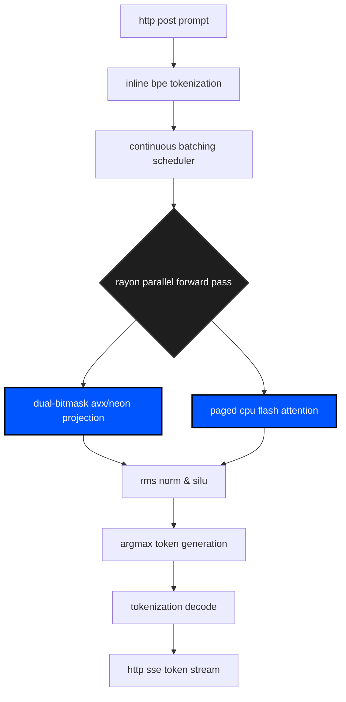

# aegis v2.0

bare-metal inference engine for 1.58-bit ternary neural networks (bitnet). written in pure rust. 

we do not use gpus. aegis maps 2-bit quantized weights directly to cpu registers using branchless dual-bitmask separation. it leverages llvm auto-vectorization to dynamically target AVX2 (intel/amd) or NEON (arm/apple) intrinsics at compile time.

the goal is absolute low-latency, offline inference on consumer edge hardware.

## architecture

### 1. gguf-native & inline bpe tokenization
no python wrappers. no separate config files. aegis parses `.gguf` files natively, reading metadata tensors and reconstructing SentencePiece BPE merges purely from the bitstream. tokenization is executed directly inside the binary using the huggingface `tokenizers` crate before passing directly to the scheduler.

### 2. continuous batching & paged kv cache
synchronous blocking limits throughput. aegis uses a non-blocking `tokio` multi-threaded runtime bound to an `axum` http framework. requests are shoved into a concurrent continuous batching queue.

memory is managed via a true `PagePool` mapped to physical block tables (akin to vLLM). when sequences generate tokens, the engine allocates fixed-size memory blocks dynamically, completely eliminating memory fragmentation and OOM panics during generation.

### 3. the ternary engine (avx/neon intrinsics)
the critical bypass. calculating `-1 * activation` using signed multiplication on a cpu is slow. aegis avoids floating point multiplication entirely. it uses a dual-bitmask separation trick: positive weights are stored in one bitmask, negative in another. during inference, a branchless lookup table (lut) expands the masks, and the engine calculates the dot product purely through addition and subtraction (`sum_pos - sum_neg`). via llvm auto-vectorization (`#[cfg_attr]`), this compiles down directly to 256-bit `vpsubb` instructions on avx2 (intel/amd) or 128-bit `vsubq` on neon (arm/apple edge).

### 4. cpu flash attention & multithreading
aegis distributes the forward pass across all physical cpu cores using `rayon`. attention queries and layers are mapped concurrently (`par_iter`). to maximize throughput, the system implements a cpu-native, paged flash attention kernel that processes physical memory blocks without materializing massive $N \times N$ attention matrices.



## build

requires rust nightly (`#![feature(portable_simd)]`).

```bash
git clone https://github.com/wheelerninja67/aegis-inference.git
cd aegis-inference

# compile with native hardware intrinsics (avx2/neon)
RUSTFLAGS="-C target-cpu=native" cargo build --release

# boot the async router
cargo run --release --bin aegis_inference
```

## api

aegis serves an openai-compatible server-sent events (sse) stream over axum.

```bash
curl -N -X POST http://127.0.0.1:8080/v1/generate \
  -H "Content-Type: application/json" \
  -d '{"prompt": "Aegis is", "max_new_tokens": 15}'
```

license: MIT
