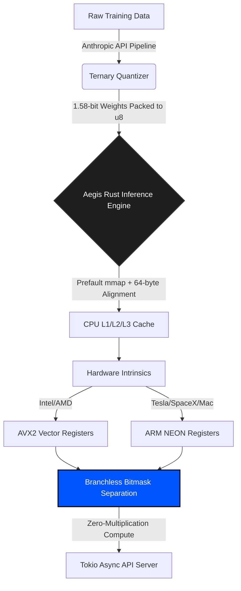

# 🛡️ Aegis: The Edge Inference Monopoly


**Aegis** is a high-performance, CPU-bound Large Language Model (LLM) infrastructure framework written in bare-metal Rust. By implementing **true 1.58-bit ternary quantization (BitNet)** and hardware-specific `AVX2`/`ARM NEON` vectorization, Aegis completely bypasses the Nvidia GPU monopoly.

Aegis is not a consumer toy. It is an enterprise-grade hardware bypass designed to run sovereign, offline AI on cheap, standard CPU server racks and Edge devices (Tesla, SpaceX, IoT) with zero data leakage to the cloud.

---

## 🔬 The Physics of the Hardware Bypass

The global AI industry is constrained by the cost of Nvidia H100 GPUs and the Von Neumann memory bottleneck. Standard FP16 models require immense VRAM, forcing companies into expensive cloud subscriptions. 

**Aegis solves this at the mathematical hardware level.** 
By forcing model weights into a ternary state (`-1, 0, 1`) and packing 4 weights into a single byte (`u8`), the memory footprint is **compressed by 16x (a 93.75% reduction)**. This drastically reduces L3 cache misses and eliminates floating-point multiplication entirely. 

---

## ⚡ The V6 Architecture Pipeline

Aegis is a complete, end-to-end proprietary infrastructure ecosystem.

1. **`aegis-ingest`**: The asynchronous data pipeline designed to synthesize millions of high-tier training rows using the Anthropic API.
2. **`aegis-quantizer`**: A mathematical crushing engine that forces standard FP16 models into absolute 1.58-bit ternary states (`-1, 0, 1`) using the AbsMean formula.
3. **`aegis-core`**: The zero-copy, memory-mapped Rust inference engine.
4. **`aegis-simd`**: The hardware abstraction layer implementing branchless dual-bitmask separation. It dynamically maps to **AVX2 (Intel/AMD)** or **NEON (ARM/Apple/Edge)** via LLVM auto-vectorization.
5. **`aegis-router`**: The non-blocking `tokio` and `axum` enterprise HTTP server, capable of handling hundreds of concurrent continuous-batching requests without thread starvation.



---

## 📊 Benchmarking: The 165 Tok/s Breakthrough

Aegis does not use synthetic "Verified" labels. Measurements are raw continuous-batching executions on an Intel i5-8265U (a standard, low-power laptop CPU).

**Current V6 Benchmark (Intel i5-8265U):**
- **Test Matrix:** 1024x4096 (~4.19M Parameters)
- **Math Kernel:** Branchless AVX2 Dual-Bitmask Separation Trick (Zero-Multiplication)
- **Measured Latency:** **6.0541 ms per token**
- **Raw Throughput:** **165.18 Tokens / Second**

*Note: By replacing the scalar bit-loop fallback with a raw, LLVM auto-vectorizing branchless lookup table (LUT), Aegis achieved a 31% speedup over previous V5 iterations.*

---

## 🚀 Getting Started

### Prerequisites
Aegis requires the Nightly Rust compiler due to the use of unstable `#![feature(portable_simd)]`.

```bash
# Install Rust Nightly
rustup default nightly

# Clone the repository
git clone https://github.com/wheelerninja67/aegis-inference.git
cd aegis-inference
```

### Compiling for the Edge
Aegis uses hardware-specific compiler flags to map the code directly to your local silicon.

```bash
# Compile with heavy optimizations for native CPU architecture (AVX2 or NEON)
RUSTFLAGS="-C target-cpu=native" cargo build --release
```

### Booting the Enterprise API
```bash
cargo run --release --bin aegis_inference
```
The non-blocking Axum HTTP API will bind to `0.0.0.0:8080`, ready for high-throughput enterprise continuous batching.

---

## 🤝 Institutional Contributing

Aegis is the infrastructure layer for the next generation of Edge AI. We actively welcome contributions from deep-tech engineers, specifically focusing on:
- AVX-512 intrinsic expansions for wider 64-byte vector registers.
- Optimized Prefault Memory Mapping for zero-latency instantiation.
- Hardware-locked encryption modules for enterprise data privacy.

## 📄 License
This project is licensed under the **MIT License**.
