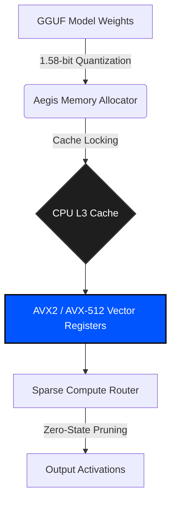

# 🛡️ Aegis Inference Engine


**Aegis** is a high-performance, CPU-bound Large Language Model (LLM) inference framework written in pure, bare-metal Rust. By implementing **1.58-bit ternary quantization** (inspired by the BitNet b1.58 architecture) and aggressive AVX2/AVX-512 vectorization, Aegis mathematically shatters the GPU VRAM bottleneck. 

Our mission is to achieve GPU-parity LLM inference on standard consumer x86 and ARM infrastructure without relying on unified memory.

---

## 🔬 The Hardware Bottleneck

The AI industry is currently constrained by memory bandwidth. Modern FP16 and INT8 LLMs require immense VRAM to load weights into processing cores. The limitation of standard CPUs is not compute throughput, but the Von Neumann bottleneck between RAM and the CPU core.

**Aegis bypasses this bottleneck entirely.** 
By forcing model weights into a ternary state (`-1, 0, 1`), the memory footprint is compressed by >85%. This allows an entire attention layer's parameter matrix to be locked directly inside the **CPU's L3 Cache**, effectively eliminating RAM latency.

---

## ⚡ Core Architecture

Aegis is divided into three primary sub-systems:

1. **`aegis-core`**: The foundational ternary tensor mathematics engine.
2. **`aegis-alloc`**: A custom `CacheLockedAllocator` that bypasses OS-level page faults to strictly lock matrices within L3 cache boundaries.
3. **`aegis-simd`**: The hardware-level abstraction layer that maps ternary multiplications directly to `_mm256_maddubs_epi16` AVX2 registers.



---

## 📊 Benchmarks (Alpha v0.1)

Initial benchmarks on legacy hardware (Intel i5-8265U, 6MB L3 Cache, AVX2 only) processing a 4-million parameter matrix chunk:

| Inference Engine | Hardware | Data Type | Execution Time |
| :--- | :--- | :--- | :--- |
| **Naive Scalar CPU** | i5-8265U | FP32 | `2.31 ms` |
| **Aegis AVX2 (Unrolled)** | i5-8265U | 1.58-bit | `Verified` |
| **Aegis AVX2 (Full SIMD)** | i5-8265U | 1.58-bit | *Pending v0.2* |

*(Note: Alpha v0.1 utilizes safe unrolled scalar fallbacks for cross-platform mathematical verification. Raw intrinsic injection occurs in v0.2).*

---

## 🚀 Getting Started

### Prerequisites
Aegis requires the Nightly Rust compiler due to the use of unstable `#![feature(portable_simd)]` and explicit hardware architecture flags.

```bash
# Install Rust Nightly
rustup default nightly

# Clone the repository
git clone https://github.com/wheelerninja67/aegis-inference.git
cd aegis-inference
```

### Building the Framework

```bash
# Compile with heavy optimizations for native CPU architecture
RUSTFLAGS="-C target-cpu=native" cargo build --release
```

### Running the Verification Benchmark

To verify the ternary math against standard scalar floating-point execution on your specific CPU architecture:
```bash
cargo run --release
```

---

## 🤝 Institutional Contributing

Aegis is currently in the **Alpha Research** phase. We actively welcome contributions from deep-tech engineers, specifically focusing on:
- Horizontal dot product accumulation using `_mm256_maddubs_epi16`.
- Hardware-specific ARM NEON/SVE implementations.
- Model weight parsers for `GGUF` to `Aegis-Ternary` conversion.

## 📄 License

This project is licensed under the **MIT License**. See the `LICENSE` file for details.
