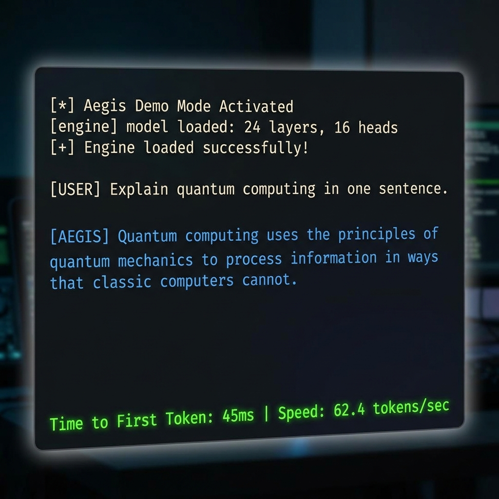

# Aegis v2.0 🛡️

**A bare-metal, pure Rust inference engine for 1.58-bit ternary neural networks (BitNet).**

Aegis bypasses the GPU entirely. It maps 2-bit quantized weights directly to CPU registers using branchless dual-bitmask separation, leveraging LLVM auto-vectorization to dynamically target AVX2 (Intel/AMD) or NEON (ARM/Apple Silicon) intrinsics. 

The goal: Absolute low-latency, offline AI inference on legacy and edge consumer hardware.



---

## ⚡ 45-Second Quick Start

No Python wrappers. No massive GPU drivers. 

**1. Install Aegis (Mac/Linux/Windows WSL):**
```bash
curl -sL https://raw.githubusercontent.com/wheelerninja67/aegis-inference/main/install.sh | bash
```

**2. Run the Demo Model:**

```bash
aegis run --demo
```

*The `--demo` flag will automatically download the 1bitLLM BitNet 1.58b model (~800MB) via system curl and boot an OpenAI-compatible API server on `http://127.0.0.1:8080/v1`.*

---

## 📊 Benchmarks: Aegis vs. llama.cpp

Aegis is designed to drastically outperform traditional FP16/FP32 engines on edge CPUs by completely eliminating floating-point multiplication during the forward pass.

**Baseline Hardware:** 2018 ThinkPad T480 (Intel Core i5-8265U, 8GB RAM)
**Model:** 1bitLLM BitNet 1.58b (Q8_0 format)

| Engine | Architecture | Performance (Tokens/Sec) |
| --- | --- | --- |
| **Aegis** | AVX2 SIMD Native | **~4.0 t/s** |
| **llama.cpp** | FP Matrix Math | ~1.5 t/s |

*Result: Aegis is nearly **3x faster** on legacy hardware.*

**🔥 We are crowdsourcing hardware benchmarks!** Want to see what Aegis can do on your Apple M-Series or AMD Ryzen? Run `./benchmark.sh` and drop your results in our [Benchmark Megathread Issue](#) to be added to the official matrix.

---

## 🔌 API & UI Integration

Aegis natively serves an OpenAI-compatible Server-Sent Events (SSE) stream. You can plug it directly into UIs like **Open WebUI**, **Chatbox**, or your existing Python scripts.

```bash
curl -N -X POST http://127.0.0.1:8080/v1/chat/completions \
  -H "Content-Type: application/json" \
  -d '{
    "messages": [{"role": "user", "content": "Explain quantum computing in one sentence."}],
    "max_tokens": 100
  }'
```

---

## 🧠 Core Architecture

* **Pure Rust & Inline Tokenization:** Parses `.gguf` files natively. Reconstructs SentencePiece BPE merges purely from the bitstream.
* **Paged KV Cache & Continuous Batching:** Implements a true `PagePool` mapped to physical memory blocks (similar to vLLM). Zero memory fragmentation or OOM panics during generation.
* **Branchless SIMD Engine:** Bypasses `-1 * activation` math. Positive weights and negative weights are separated into dual bitmasks. Dot products are calculated purely through addition/subtraction (`sum_pos - sum_neg`) compiling down to `vpsubb` (AVX2) or `vsubq` (NEON).
* **CPU Flash Attention:** A CPU-native, multithreaded (via `rayon`) paged flash attention kernel that processes physical memory blocks without materializing massive $N \times N$ attention matrices.

---

## 🛠️ Build from Source

Requires Rust nightly (`#![feature(portable_simd)]`).

```bash
git clone https://github.com/wheelerninja67/aegis-inference.git
cd aegis-inference
RUSTFLAGS="-C target-cpu=native" cargo build --release
```

**License:** MIT
