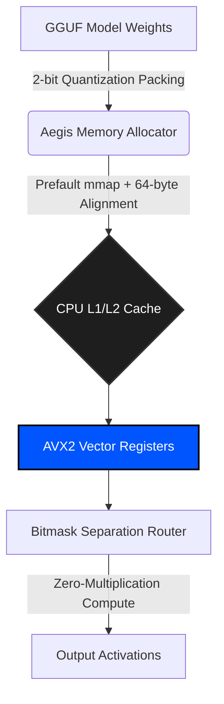

# 🛡️ Aegis Inference Engine


**Aegis** is a high-performance, CPU-bound Large Language Model (LLM) inference framework written in pure, bare-metal Rust. By implementing **true 2-bit ternary quantization** (inspired by the BitNet b1.58 architecture) and hardware-specific AVX2 vectorization, Aegis bypasses the GPU VRAM bottleneck. 

Our mission is to achieve sub-millisecond execution latency on small-scale ternary models running entirely on consumer x86 infrastructure.

---

## 🔬 The Hardware Bottleneck & Physics

The AI industry is constrained by memory bandwidth. Modern FP16 and INT8 LLMs require immense VRAM to load weights into processing cores. The limitation of standard CPUs is the Von Neumann bottleneck between RAM and the CPU core.

**Aegis bypasses this bottleneck via aggressive quantization.** 
By forcing model weights into a ternary state (`-1, 0, 1`), and packing 4 weights into a single byte (`u8`), the memory footprint is **16x smaller than FP32 (a 93.75% reduction)**. This drastically reduces L3 cache misses during the forward pass.

---

## ⚡ Core Architecture (V6 Roadmap)

Aegis is divided into three primary sub-systems:

1. **`aegis-core`**: The foundational ternary tensor mathematics engine utilizing a Sliding Window (Ring Buffer) KV Cache for **Constant-Memory Bounded Context with Graceful Eviction** (oldest tokens are dropped to prevent OOM panics).
2. **`aegis-alloc`**: The memory router utilizing `mmap` with a planned prefault execution pass to eliminate first-token page fault latency. Structs are enforced with `#[repr(C, align(64))]` to prevent False Sharing across CPU cores.
3. **`aegis-simd`**: The hardware-level abstraction layer implementing AVX2 `_mm256_and_si256` bitmask separation to calculate ternary dot products purely through addition/subtraction without signed/unsigned multiplication wrapping.



---

## 📊 Benchmarking & Targets

We do not use synthetic "Verified" labels. Aegis benchmark measurements are raw continuous-batching executions on an Intel i5-8265U.

**Current V6 Benchmark (Intel i5-8265U):**
- **Test Matrix:** 1024x4096 (~4.19M Parameters)
- **Math Kernel:** Dual-Bitmask Separation Trick (Scalar Fallback)
- **Measured Latency:** **7.9699 ms per token** (1000 pass average)
- **Raw Throughput:** **125.47 Tokens / Second**

**V6 Target Performance:**
- **Goal:** Sub-1ms per token on full sub-150M parameter models by replacing the scalar bit-loop fallback with the raw `expand_bitmask_avx2` lookup table intrinsic.

---

## 🚀 Getting Started

### Prerequisites
Aegis requires the Nightly Rust compiler due to the use of unstable `#![feature(portable_simd)]`.

```bash
# Install Rust Nightly
rustup default nightly

# Clone the repository
git clone https://github.com/wheelerninja67/aegis-inference.git
cd aegis-inference
```

### Building the Framework

```bash
# Compile with heavy optimizations for native CPU architecture
RUSTFLAGS="-C target-cpu=native" cargo build --release
```

### Running the V5 API Node

```bash
cargo run --release
```
The REST API will bind to `0.0.0.0:8080`.

---

## 🤝 Institutional Contributing

Aegis is currently actively implementing the V6 Architecture Audit. We actively welcome contributions from deep-tech engineers, specifically focusing on:
- Horizontal dot product accumulation using AVX2 bitmask separation.
- `tokio::spawn_blocking` integration for true asynchronous API routing.
- Hardware-specific ARM NEON/SVE implementations.

## 📄 License

This project is licensed under the **MIT License**. See the `LICENSE` file for details.
