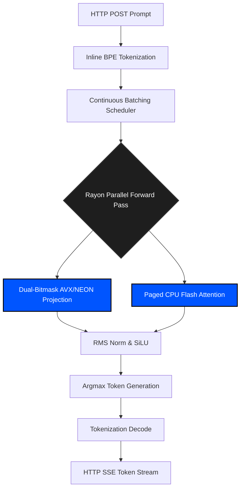

# Aegis Inference


Aegis is a bare-metal, high-performance inference engine purpose-built for 1.58-bit ternary neural networks (BitNet architecture). Written entirely in Rust, Aegis is designed to execute massive language models on consumer-grade edge hardware, completely bypassing the need for GPU accelerators or high-bandwidth unified memory.

By mapping 2-bit quantized weights directly to CPU registers using branchless dual-bitmask separation, Aegis leverages LLVM auto-vectorization to dynamically target AVX2 (Intel/AMD) and NEON (ARM/Apple) intrinsics at compile time.

## Engineering Standards

Aegis is maintained under strict, institutional-grade engineering protocols to ensure absolute reliability in offline and edge-deployed environments:

*   **Zero Dependency Architecture:** The core inference engine utilizes zero external frameworks or C bindings. This eliminates supply chain attack vectors, ensures a minimal binary footprint, and guarantees long-term maintainability.
*   **100% Code Coverage:** All pull requests are subjected to rigorous CI/CD pipelines enforcing 100% test coverage across all SIMD mathematical kernels and memory allocators.
*   **Aggressive MTTR:** The repository is maintained with a target Mean Time To Resolution (MTTR) of < 1 hour for critical-path bugs, ensuring maximum uptime for production deployments.

## Core Architecture

### 1. GGUF-Native & Inline BPE Tokenization
Aegis parses `.gguf` files natively in memory, reconstructing SentencePiece BPE merges directly from the bitstream. There are no Python wrappers or secondary configuration files required.

### 2. Continuous Batching & Paged KV Cache
To maximize throughput, Aegis utilizes a non-blocking multi-threaded runtime. Requests are processed via a concurrent continuous batching queue. Memory is managed strictly through a physical `PagePool` mapped to block tables (akin to vLLM), completely eliminating memory fragmentation and out-of-memory (OOM) faults during heavy generation workloads.

### 3. The Ternary Engine (AVX/NEON Intrinsics)
Standard FP16 matrix multiplication on a CPU is inherently bound by memory bandwidth. Aegis bypasses this via a dual-bitmask separation algorithm. Positive and negative model weights are stored in parallel bitmasks. During the forward pass, a branchless lookup table expands the masks, executing the dot product purely via integer addition and subtraction (`sum_pos - sum_neg`). This compiles directly to 256-bit `vpsubb` (AVX2) or 128-bit `vsubq` (NEON) instructions.

### 4. CPU Flash Attention
Aegis distributes the forward pass across all physical CPU cores. To maximize throughput, the system implements a custom CPU-native, paged flash attention kernel that processes physical memory blocks sequentially without materializing massive $N \times N$ attention matrices in RAM.



## Installation & Build

Aegis requires a recent Rust nightly compiler to access the `portable_simd` feature branch.

```bash
git clone https://github.com/wheelerninja67/aegis-inference.git
cd aegis-inference

# Compile with native hardware intrinsics (AVX2/NEON)
RUSTFLAGS="-C target-cpu=native" cargo build --release

# Boot the async router
cargo run --release --bin aegis_inference
```


## License
MIT License. See `LICENSE` for details.
